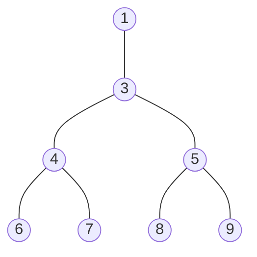

# Ejercicio 1

1. 
    - **Divide**: 5, 6, 7
    - **combine**: 9
    - **conquer**: 2, 3
2. Dos subproblemas.
3. El largo del array de entrada dividido dos (división entera).
4. $O(n)$ porque estamos iterando a través de los índices de las dos mitades, en el peor caso las dos mitades tienen el mismo largo y tenemos que recorrer todos los índices del array.
5. Sabemos que $T$ va a tener esta forma: $T(n) = a*T(n/c) + f(n)$, luego, habiamos identificado que $a=2$, $c=2$, $f(n) = n$. Entonces nos queda que: $T(n) = 2*T(n/2) + n$
6. Sabemos que: $a=2$, $c=2$, $f(n) = n$, solo nos queda calcular $n^{\log_{c}{a}}=n^{\log_{2}{2}}=n^1$. Luego vemos que por el segundo caso del teorema maestro tenemos que $f(n)=n^{\log_{c}{a}}$ pues $f(n)=n=n^1=n^{\log_{c}{a}}=n^{\log_{2}{2}}$. Finalmente, por Teorema maestro tenemos que la complejidad temporal de $T$ es $O(n*\log{(n)})$

# Ejercicio 2

1. 
    - **Divide**: 5, 8, 9, 10, 11
    - **combine**: 6 y 7
    - **conquer**: 2, 3, 6 y 7 (sí, 6 y 7 también porque el combine es igual al conquer en este caso también se puede pensar como que "no hay combine")
2. 1 subproblema.
3. El largo del subarray de entrada dividido dos (división entera), notar que un array también es su propio subarray.
4. $O(1)$ porque solo devuelvo al elemento buscado (que implica un acceso a memoria) y si no lo encuentro entonces solo devuelvo un booleano.
5. Sabemos que $T$ va a tener esta forma: $T(n) = a*T(n/c) + f(n)$, luego, habiamos identificado que $a=1$, $c=2$, $f(n) = 1$. Entonces nos queda que: $T(n) = 1*T(n/2) + 1$
6. Sabemos que: $a=1$, $c=2$, $f(n) = 1$, solo nos queda calcular $n^{\log_{c}{a}}=n^{\log_{2}{1}}=n^0$. Luego vemos que por el tercer caso del teorema maestro tenemos que 
$$
f(n)=n^{\log_{c}{a}}*\log^k{n} \text{ con } k \in \mathbb{R} \ / \ k\geq 0 \\

\text{si tomamos } k = 0 \text{ entonces } \\

= f(n)=n^{\log_{c}{a}}*\log^k{n}=\\

= f(n)=n^{\log_{2}{1}}*\log^k{n}=\\

= f(n)=n^{0}*\log^k{n}=\\

= f(n)=1*\log^0{n}=\\

= f(n)=1*1=\\

= f(n)=1=\\

= 1=1\\
$$

Finalmente, por Teorema maestro tenemos que la complejidad temporal de $T$ es 
$$
O(n^{\log_{c}{a}}*\log^{k+1}{n}) = \\
O(n^{\log_{2}{1}}*\log^{k+1}{n}) = \\
O(n^{0}*\log^{k+1}{n}) = \\
O(1*\log^{k+1}{n}) = \\
O(\log^{0+1}{n}) = \\
O(\log^{1}{n}) = \\
O(\log{n}) \\
$$

# Ejercicio 3

```plaintext
Asumimos que el arreglo se indexa desde 0

VARIABLE GLOBAL: arreglo
Algoritmo(i, j):

    # Conquer
    si j - i == 1{
        retornar arreglo[i] > arreglo[j]
    }

    # Divide
    medio = j + i // 2, donde `//` se refiere a la división entera o cociente
    
    # Conquer
    suma_izq = 0
    para k:=i hasta medio+1{
        suma_izq += arreglo[k]
    }

    suma_der = 0
    para k:=medio+1 hasta j+1{
        suma_der += arreglo[k]
    }

    si suma_izq < suma_der:
        retornar False

    # Combine
    retornar Algoritmo(i, medio) && Algoritmo(medio, j)
```

**Complejidad temporal**: $a=2$, $c=2$, $f(n)=n$ $\implies T(n) = 2*T(n/2) + n$, por el segundo caso del Teorema maestro nos queda que la complejidad temporale es $O(n*\log{n})$ 

# Ejercicio 4

```plaintext
Asumimos que el arreglo se indexa desde 0

VARIABLE GLOBAL: arreglo, largo_arreglo
Algoritmo(i, j):

    si i > j:
        retornar False
    
    indice_act = (j+i) // 2
    actual = arreglo[indice_act]
    
    si actual == indice_act:
        retornar True
    sino:
        si actual > indice_act:
            retornar Algoritmo(i, indice_act-1, arreglo)
        sino:
            retornar Algoritmo(indice_act+1, j, arreglo)
```

**Complejidad temporal**: $a=1$, $c=2$, $f(n)=1$ $\implies T(n) = 1*T(n/2) + 1$, por el tercer caso del Teorema maestro nos queda que la complejidad temporale es $O(\log{n})$

# Ejercicio 5

```python

def potenciaLogaritmica(base:int, potencia:int)->int:

    # Conquer
    if potencia == 0:
        return 1
    elif potencia == 1:
        return base

    # Divide
    potencia_en_par:int = potencia // 2
    otro_calculo:int = potenciaLogaritmica(base, potencia_en_par)
    
    # Combine
    if potencia % 2 == 1:
        return base * potenciaLogaritmica(base, potencia - 1)

    return otro_calculo * otro_calculo
```

El algoritmo se divide en un solo subproblema (pues solo vemos una sola rama en el divide) de tamaño $n/2$ pues dividimos a la potencia en 2, finalmente el combine cuesta 1 y llegamos a que tenemos la siguiente fuinción de recursión $T(n)=1*T(n/2)+1$ que por el tercer caso del teorema maestro tenemos que la complejidad es $O(log(n))$ si tomamos $k=0$

# Ejercicio 6

```python

from math import inf

def maximoMontania(i:int, j:int, arreglo:list[int])->int:

    if i > j:
        return -inf

    indice_actual = (j + i) // 2
    actual = arreglo[indice_actual]

    va_creciendo:bool = arreglo[indice_actual-1] < actual
    va_decreciendo:bool = arreglo[indice_actual+1] < actual
    
    if va_creciendo and va_decreciendo:
        return actual
    elif va_creciendo and not va_decreciendo:
        return maximoMontania(indice_actual+1, j, arreglo)
    else:
        # not va_creciendo and va_decreciendo:
        return maximoMontania(i, indice_actual, arreglo)
```

# Ejercicio 7

> skip por ahora

# Ejercicio 8

```python
def maximaSubsecuencia(i:int, j:int, array:list[int]):
    
    # Conquistar
    if i == j:
        return array[i]
    
    # Dividir
    medio:int = (i + j) // 2
    mitad_izquierda:int = maximaSubsecuencia(i, medio, array)
    mitad_derecho:int = maximaSubsecuencia(medio+1, j, array)

    acc:int = 0
    suma_izquierda:int = -inf
    for k in range(medio, i-1, -1):
        acc +=  array[k]
        suma_izquierda = max(suma_izquierda, acc)
    
    acc:int = 0
    suma_derecha:int = -inf
    for k in range(medio+1, j+1):
        acc +=  array[k]
        suma_derecha = max(suma_derecha, acc)

    suma_medio:int = suma_izquierda + suma_derecha

    # Combine
    return max(mitad_izquierda, mitad_derecho, suma_medio)
```

# Ejercicio 9

```python
def potenciaSum(matriz:list[list[int]], potencia:int)->int:

    # Conquistar
    if potencia == 1:
        return matriz

    # Dividir
    potencia_mitad:int = potencia // 2
    res_parcial:int = potenciaSum(matriz, potencia_mitad)

    # Combinar
    return res_parcial + potencia(matriz, potencia) * res_parcial
```

El algoritmo aplica el método $potencia$, suma y hace productos de matrices una cantidad estrictamente menor que $O(n)$ veces pues en el combine reducimos el tamaño de la potencia a la mitad (eso es logarítmico), usar $potencia$ tiene costo $O(1)$ porque sabemos que el orden de la matriz es $4x4$, hacer el producto entre dos matrices tiene costo $O(1)$ porque sabemos que ambas matrices tienen orden 4x4, sumar dos matrices tiene complejidad $O(1)$ por el mismo motivo, sabemos que ambas tienen orden 4x4. 

Finalmente tenemos que el algoritmo se divide en un subproblema de tamaño $n/2$ y combinar tiene costo $O(1)$, nos queda entonces que nuestra función de recursión es $T(n)=1*(n/2) +1$ que por el tercer caso del teorema maestro (si tomamos $k=0$) llegamos a que la complejidad temporal del algoritmo es $O(\log{(n)}$

# Ejercicio 10

### Aclaración por si también llegaste a tener la misma confusión que yo

Cuando te hablan de *"la máxima distancia entre dos nodos (es decir, máxima cantidad de ejes a atravesar)"* **NO** te están diciendo que "dados dos nodos entonces dime el camino más largo entre ellos" (**NO**), lo que te están diciendo es *"máster, tienes que irte al árbol y buscar **el camino** más largo que que exista **en** ese árbol, al ser un camino eso involucra dos nodos"*

Ejemplito

Ponele que tienes este árbol binario:



Lo que **NO** te están diciendo es: *"che, dime cuál es el camino más largo entre el 4 y el 5"*. Que tiene como respuesta: 2, si vemos el camino 4---3---5

Lo que **SÍ** te están diciendo es: *"che, dime cuál es el camino más largo del árbol, no me importan los nodos en cuestión"*. Que tiene como respuesta: 4, si vemos -por ejemplo- el camino 6---4---3---5---9.

> Si aún sigues sin entender, el nombre del problema es: **Diametro de un árbol binario** (en inglés es igual), puedes investigar sobre ello en internet.

```python
def distanciaMaxima(nodoAct:Nodo, arbolBinario:ArbolBinario)->tuple[int, int]:

    if nodoAct is None:
        return (0, 0)

    h_izq, c_izq = distanciaMaxima(nodoAct.izq, arbolBinario)
    h_der, c_der = distanciaMaxima(nodoAct.der, arbolBinario)
    
    h_actual:int = 1 + max(h_izq, h_der)
    cruzado:int = h_izq + h_der
    
    return h_actual, max(c_izq, c_der, cruzado)
```

# Ejercicio 11

```python
def merge(array_izq:list[int], array_der:list[int])->tuple[list[int], int]:

    k = t = 0

    largo_izq:int = len(array_izq)
    largo_der:int = len(array_der)

    mergeados:list[int] = []

    cant_p_desorden:int = 0 
    while k < largo_izq and t < largo_der:
        if array_izq[k] <= array_der[t]:
            mergeados.append(array_izq[k])
            k += 1
        else:
            cant_p_desorden += largo_izq - k
            mergeados.append(array_der[t])
            t += 1

    mergeados += array_izq[k:]
    mergeados += array_der[t:]
        
    return mergeados, cant_p_desorden

def desordenSort(array:list[int])->tuple[list[int], int]:

    largo = len(array)

    # Conquer
    if largo <= 1:
        return array, 0
    
    # Divide
    mitad:int = largo // 2
    array_izq, cant_izq = desordenSort(array[:mitad])
    array_der, cant_der = desordenSort(array[mitad:])
    
    # Combine
    array, cant_merge = merge(array_izq, array_der)

    # Conquer
    return array, cant_izq + cant_der + cant_merge
```

# Ejercicio 12

