# Ejercicio 1

1. $C = \{6, 12, 6\}$ y $k = 12$.
    1. $a = (0, 0, 0)$
    2. $a = (1, 0, 0)$
    3. $a = (0, 1, 0)$
    4. $a = (0, 0, 1)$
    5. $a = (1, 1, 0)$
    6. $a = (1, 0, 1)$
    7. $a = (0, 1, 1)$
    8. $a = (1, 1, 1)$

2. $C = \{6, 12, 6\}$ y $k = 12$.
    1. $a = (0, 1, 0)$
    2. $a = (1, 0, 1)$

3. Listo según valores de i (1, 2, 3)

    1. 
        * $a = (0)$
        * $a = (1)$

    2. 
        * 
            - $a = (0, 1)$
            - $a = (0, 0)$
        * 
            - $a = (1, 0)$
            - $a = (1, 1)$

    3. 
        * 
            - $a = (0, 1, 0)$
            - $a = (0, 1, 1)$
        * 
            - $a = (0, 0, 0)$
            - $a = (0, 0, 1)$
        * 
            - $a = (1, 0, 1)$
            - $a = (1, 0, 0)$
        * 
            - $a = (1, 1, 0)$
            - $a = (1, 1, 1)$

Esto lo podemos representar como un árbol binario

```mermaid
graph TD
    %% Nivel 0 (Raíz teórica)
    Root((Raíz inicio)) --> N0["(0)"]
    Root --> N1["(1)"]

    %% Nivel 1 a 2
    N0 --> N01["(0, 1)"]
    N0 --> N00["(0, 0)"]
    N1 --> N10["(1, 0)"]
    N1 --> N11["(1, 1)"]

    %% Nivel 2 a 3
    N01 --> N010["(0, 1, 0)"]
    N01 --> N011["(0, 1, 1)"]
    
    N00 --> N000["(0, 0, 0)"]
    N00 --> N001["(0, 0, 1)"]
    
    N10 --> N101["(1, 0, 1)"]
    N10 --> N100["(1, 0, 0)"]
    
    N11 --> N110["(1, 1, 0)"]
    N11 --> N111["(1, 1, 1)"]

    %% Estilos
    style Root fill:#000,stroke:#333,stroke-width:2px
```



Esa ráiz está ahí solo para poder tomarla como un primer nodo del árbol, es totalmemente teórica. En caso de no querer usarla se puede armar dos árboles disjuntos, uno donde la ráiz sea $a=(0)$ y otro donde la raíz sea $a=(1)$

4. 

Esto es básicamente graficar al árbol pero podado

```mermaid
graph TD
    %% Nivel 0 (Raíz teórica)
    Root((Raíz inicio)) --> N0["(0)"]
    Root --> N1["(1)"]

    %% Nivel 1 a 2
    N0 --> N01["(0, 1)"]
    N0 --> N00["(0, 0)"]
    N1 --> N10["(1, 0)"]
    N1 --> N11["(1, 1)"]

    %% Nivel 2 a 3
    N01 --> N010["(0, 1, 0)"]
    
    N10 --> N101["(1, 0, 1)"]
    
    %% Estilos
    style Root fill:#000,stroke:#333,stroke-width:2px
```



5. Fíjate que lo que está haciendo es hacer la disyuntoria entre todos los nodos posibles de un árbol binario como el que te mostré en el punto **3**. Si como el elemento neutro de la disyuntoria es **False**, entonces esta función solo te va a devolver True en caso de que exista un subconjunto de $C$ que sume k pues, la función recursiva se fija si puede llegar a sumar k o no probando las dos combinaciones posibles entre tomar en cuenta o no a un subconjunto $c_i \in C$, la idea es que va disminuyendo al k y si llega a ocurrir que haces un llamado recursivo con $k=0$ entonces solo vas a devolver True, caso contrario devuelves **False**, al final te va a quedar algo como: $False \lor False \lor \dots \lor True \lor \dots$ y con que haya un True la función te devuelve **True**, sino **False**

6. 

$
\quad\quad\begin{aligned}
\quad\quad 1 \quad & \text{subset\_sum}(C, i, j) \quad // \text{implementa } ss(\{c_1, \dots, c_i\}, j) \\
\quad\quad 2 \quad & \text{Si } i = 0, \text{ retornar } (j = 0) \\
\quad\quad 3 \quad & \text{Si no, retornar } \\
        & \quad \text{subset\_sum}(C, i - 1, j) \;\lor\; \text{subset\_sum}(C, i - 1, j - C[i])
\quad\quad\end{aligned}
$

Notar que es la misma idea del ítem anterior. Acá el $i$ es el iterador (ponele) del conjunto, y el $j$ es el $k$.

7. 

Para poder relacionar este árbol con la regla de lo que sería alguna de las soluciones, tenemos que imaginar que cada nodo de este árbol representa una solución $a$ pero al revés, ejemplo: si teníamos algo como $a=(0,0,1)$ en el árbol del punto **3**, acá va a ser $a=(1, 0 ,0)$.


8. 

$
\begin{aligned}
\quad\quad 1 \quad & \text{subset\_sum}(C, i, j) \quad // \text{implementa } ss(\{c_1, \dots, c_i\}, j) \\
\quad\quad 2 \quad & \text{Si } j < 0, \text{ retornar } \text{falso} \quad // \text{regla de factibilidad} \\
\quad\quad 3 \quad & \text{Si } i = 0, \text{ retornar } (j = 0) \\
\quad\quad 4 \quad & \text{Si no, retornar } \\
        & \quad \text{subset\_sum}(C, i - 1, j) \;\lor\; \text{subset\_sum}(C, i - 1, j - C[i])
\end{aligned}
$

Fíjate que es todo lo mismo que venimos hablando pero no se va a poner a buscar en ramas donde ya sabe que el subconjunto de $C$ ya tiene una sumatoria mayor que $k$.

9. Si se hace el llamado $\text{subset\_sum}(C, i, 0)$, devolver True.

10. 

$
\begin{aligned}
\quad\quad 1 \quad & \text{subset\_sum}(C, p, i, j) \quad // \text{implementa } ss(\{c_1, \dots, c_i\}, j) \\
\quad\quad 2 \quad & \text{Si } j = 0, \text{ retornar } p \quad // \text{regla de factibilidad} \\
\quad\quad 3 \quad & \text{Si } j < 0 \;\lor\; i = 0, \text{ retornar } \{\} \quad // \text{regla de factibilidad} \\
\quad\quad 4 \quad & \text{Sea } \text{r = subset\_sum}(C, p, i - 1, j) \\
        & \text{ si } r \neq \{\}, \text{ retornar } r \\
\quad\quad 5 \quad & \text{Si no, retornar } \text{subset\_sum}(C, p + C[i], i - 1, j - C[i])
\end{aligned}
$

# Ejercicio 2

1. Si usamos fuerza bruta entonces habría que generar todos los cuadrados de orden n posibles, como sabemos que la casilla $ij$ del cuadrado puede tener un valor entre 1 y $n^2$, entonces cada casilla tendría $n^2$ posibibilidades, la complejidad final sería la productoria entre todas las posibilidades de cada casilla del cuadrado, eso es: $(n^2)^{n^2}$

2. Voy con python

```python

usados: set = set()
cuadrado: list[list[int]] = []

def es_valido(i: int, j: int, n: int, suma_objetivo) -> bool:
    global cuadrado

    if suma_objetivo is None:
        return True

    # Fila i (parcial hasta columna j)
    suma_fila:int = 0
    for k in range(0, j+1):
        suma_fila += cuadrado[i][k]

    if suma_fila > suma_objetivo:
        return False
    if j == n - 1 and suma_fila != suma_objetivo:   # fila completa
        return False

    # Columna j (parcial hasta fila i)
    suma_col = 0
    for k in range(0, i+1):
        suma_col += cuadrado[k][j]
    
    if suma_col > suma_objetivo:
        return False
    if i == n - 1 and suma_col != suma_objetivo:    # columna completa
        return False

    # Diagonal principal (solo si (i,j) pertenece a ella)
    if i == j:
        suma_dp = 0
        for k in range(0, i+1):
            suma_dp += cuadrado[k][k]
        if suma_dp > suma_objetivo:
            return False
        if i == n - 1 and suma_dp != suma_objetivo: # diagonal completa
            return False

    # Diagonal secundaria (solo si (i,j) pertenece a ella)
    if i + j == n - 1:
        suma_ds = 0
        for k in range(0, i+1):
            suma_ds += cuadrado[k][n- 1- k]
        if suma_ds > suma_objetivo:
            return False
        if i == n - 1 and suma_ds != suma_objetivo: # diagonal completa
            return False

    return True


def magiCuadrados(i: int, j: int, n: int, suma_objetivo) -> int:
    global usados
    global cuadrado

    if i == n:
        return 1

    # Siguiente posición en orden fila por fila
    i_sig = i
    j_sig = j

    if j < n - 1:
        j_sig = j + 1
    else:
        i_sig = i + 1
        j_sig = 0

    cant_cuadrados_validos:int = 0
    for valor in range(1, pow(n, 2) + 1):
    
        if valor in usados:
            continue

        usados.add(valor)
        cuadrado[i][j] = valor

        nueva_suma = suma_objetivo
        if i == 0 and j == n - 1:
            nueva_suma = sum(cuadrado[0])

        if es_valido(i, j, n, nueva_suma):
            cant_cuadrados_validos += magiCuadrados(i_sig, j_sig, n, nueva_suma)

        usados.remove(valor)
        cuadrado[i][j] = 0

    return cant_cuadrados_validos

def contarMagiCuadrados(n: int) -> int:
    global usados
    global cuadrado

    usados = set()
    cuadrado = [[0] * n for _ in range(n)]
    return magiCuadrados(0, 0, n, None)
```

Le hago skip a la parte del árbol.

3. **Demostración por construcción:** 

El algoritmo prueba por cada posicion del cuadrado de dimensiones $n\times n$ colocar un número entre 1 y $n^2$ sin repetir ninguno de los números utilizados, por lo tanto, tendríamos que probar cada una de las permutaciones posibles de colocar alguno de los números del conjunto $\{1, \dots, n^2\}$ en el cuadrado. Como vamos armando el árbol de backtracking según soluciones parciales que incluyen dichas permutaciones entonces nuestro árbol de backtracking tendría en el nivel $k$ un total de $k$ casillas asignadas y quedarían -por lo tanto- $n^{2}-k$ disponibles, evaluando cada uno de los posibles valores cada casilla dentro del conjunto de números disponibles (sin usar), entonces, serían un total de $(n^2)(n^{2}-1)(n^{2}-2)\dots 1=n^{2}!$ que eso da un total de $O(n^2)!$ nodos en el árbol de backtracking.

4. Acá es donde me doy cuenta que lo que nos pedían antes no tenía que tener alguna poda potente, era más un fuerza bruta ponele.

Por supuesto que eso mejora las podas, fuertemente porque no nos vamos a poner a revisar ramas del árbol que nos hubiesen llevado a cuadrados mágicos inválidos. (Eso no es una demo formal, pero tampoco la piden).

5. 

Admito que tuve que investigar un poco porque no entendía de dónde salía el $n^3$, pero para eso estamos, para aprender ;).

**Demostración:**

Sabemos que un cuadrado mágico va a tener los números del 1 a $n^2$ y que todas las filas y columnas y la diagonal tiene que valer lo mismo. Podemos decir entonces que si todas las filas valen lo mismo entonces eso es igual a $fila_1 + fila_2 + \dots + fila_n = n * número \ mágico$, ahora bien también podemos notar que -siguiendo las propiedades de un cuadrado mágico-, la sumatoria de todas las filas debe ser igual a la sumatoria de todas las casillas, como tenemos $n^2$ casillas, entonces podemos plantear $fila_1 + fila_2 + \dots + fila_n = n^2\frac{(n^{2}+1)}{2}$ luego, como la sumatoria de las posiciones de cada casilla en cada fila es igual a la sumatoria de los números de todas las casillas del cuadrado podemos plantear que 

$n^2\frac{(n^{2}+1)}{2} = n \times número \ mágico$

$n^2\frac{(n^{2}+1)}{2 \times n} = número \ mágico$

$n\frac{(n^{2}+1)}{2} = número \ mágico$

$\square$

**Implementación:**

```python

usados: set = set()
cuadrado: list[list[int]] = []

def es_valido(i: int, j: int, n: int) -> bool:
    global cuadrado

    suma_objetivo:int = n*(pow(n, 2)+1) / 2

    # Fila i (parcial hasta columna j)
    suma_fila:int = 0
    for k in range(0, j+1):
        suma_fila += cuadrado[i][k]

    if suma_fila > suma_objetivo:
        return False
    if j == n - 1 and suma_fila != suma_objetivo:   # fila completa
        return False

    # Columna j (parcial hasta fila i)
    suma_col = 0
    for k in range(0, i+1):
        suma_col += cuadrado[k][j]
    
    if suma_col > suma_objetivo:
        return False
    if i == n - 1 and suma_col != suma_objetivo:    # columna completa
        return False

    # Diagonal principal (solo si (i,j) pertenece a ella)
    if i == j:
        suma_dp = 0
        for k in range(0, i+1):
            suma_dp += cuadrado[k][k]
        if suma_dp > suma_objetivo:
            return False
        if i == n - 1 and suma_dp != suma_objetivo: # diagonal completa
            return False

    # Diagonal secundaria (solo si (i,j) pertenece a ella)
    if i + j == n - 1:
        suma_ds = 0
        for k in range(0, i+1):
            suma_ds += cuadrado[k][n- 1- k]
        if suma_ds > suma_objetivo:
            return False
        if i == n - 1 and suma_ds != suma_objetivo: # diagonal completa
            return False

    return True


def magiCuadrados(i: int, j: int, n: int) -> int:
    global usados
    global cuadrado

    if i == n:
        return 1

    # Siguiente posición en orden fila por fila
    i_sig = i
    j_sig = j

    if j < n - 1:
        j_sig = j + 1
    else:
        i_sig = i + 1
        j_sig = 0

    cant_cuadrados_validos:int = 0
    for valor in range(1, pow(n, 2) + 1):
    
        if valor in usados:
            continue

        usados.add(valor)
        cuadrado[i][j] = valor

        if es_valido(i, j, n):
            cant_cuadrados_validos += magiCuadrados(i_sig, j_sig, n)

        usados.remove(valor)
        cuadrado[i][j] = 0

    return cant_cuadrados_validos

def contarMagiCuadrados(n: int) -> int:
    global usados
    global cuadrado

    usados = set()
    cuadrado = [[0] * n for _ in range(n)]
    return magiCuadrados(0, 0, n)
```

# Ejercicio 3

1. 

```python
def maxiSubconjunto(matriz:list[list[int]], I:set[int], k:int)->int:
    if k == 0:
        acc:int = 0
        for i in range(0, k+1):
            for k in range(i, k+1):
                acc += matriz[i][k]
        return acc

    resultados:list[int] = []
    for valor in range(1, n):
        if valor not in I:
            I.add(valor)
            resultados.append(maxiSubconjunto(matriz, I, k-1))
    return max(resultados)
```