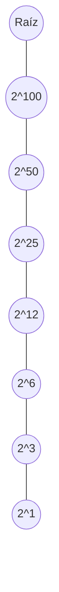
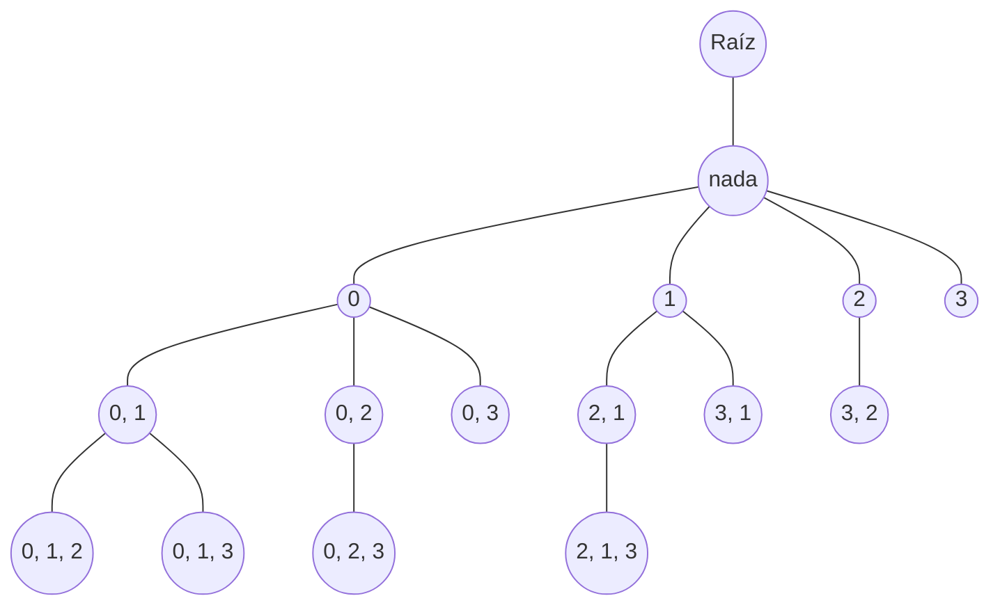

# ¿Cómo utilizar esto?

## Paso 1

Modifica este bloque:

```python
def algoritmo(*args, el_argumento_que_quieres_trackear, nodo_padre:Nodo):
    nuevo_nodo:Nodo = nodo_padre.agregar_hijo(el_argumento_que_quieres_trackear)

    """
    la lógica de tu función acá
    """

    """
    Ahora ponele que llamas a la recursión con otros argumentos
    """

    algoritmo(*args, el_argumento_que_quieres_trackear, nuevo_nodo)

    """
    No interesa qué argumentos le pases a tu función, lo único que importa
    es que -efectivamente- le pases el nuevo nodo en cuestión.
    """
```

del siguiente modo:

1. 
    ```python
    def algoritmo(*args, el_argumento_que_quieres_trackear, nodo_padre:Nodo):
    ```
    Acá lo importante es que quieres trackear (o darle visualizar) un valor en un nodo no? Entonces lo que tienes que tener en claro es que `el_argumento_que_quieres_trackear` es literalmente eso: el valor del nodo que quieres visualizar en el árbol. 
    Luego, tienes que meterle a la fuerza un argumento más a tu algoritmo: `nodo_padre`, si eso no está, todo mal.

2. 
    ```python
    nuevo_nodo:Nodo = nodo_padre.agregar_hijo(el_argumento_que_quieres_trackear)
    ```

    Acá tienes que meterle un hijo a `nodo_padre`, básicamente, el valor del argumento que quieres trackear.
    
    Ojo que si el tamaño del valor (refiriendonos al tamaño que ocupa en pantalla el valor) es demasiado grande, entonces no se va a ver bien en el nodo, aún está en desarrollo este módulo. También tienes que tomar en cuenta que si estás trabajando con conjuntos (`set`) entonces te conviene meter estas líneas antes de generar al nuevo nodo: 
    ```python
    valores = ", ".join(f"{str(valor)}" for valor in tu_conjunto)
    if valores == "":
        valores = "nada"

    nuevo_nodo = nodo_padre.agregar_hijo(f"{valores}")
    ```
    O algo similar en caso de que estés trabajando con una estructura que no tenga una representación válida de renderización para mermaid en caso de que esté vacía (listas, matrices, set(), por ejemplo). La verdad es que te vas a dar cuenta de esto cuando intentes renderizar tu árbol y te tire un error como:

    ```
    Expecting 'TAGEND', 'STR', 'MD_STR', 'UNICODE_TEXT', 'TEXT', 'TAGSTART', got 'PE'
    ```

3. 
    ```python
    algoritmo(*args, el_argumento_que_quieres_trackear, nuevo_nodo)
    ```
    acá es bien easy, cuando llames a la recursión entonces pasale el nuevo nodo y listo; no importan cuales sean los otros argumentos, tú llama a tu recursión tranqui pero asegurate de meterle el nuevo nodo.

## Paso 2:

Modifica esta función:

```python
def main():

    raiz:Nodo = Nodo('Raíz')
    graficador:GraficadorBT = GraficadorBT(raiz, "mi_grafito.md")

    algoritmo("los_argumentos_iniciales", raiz)
    graficador.graficar()
```

Simplemente llamando a tu algoritmo con los argumentos inciales necesarios pero asegurandote de pasarle la raíz.

Puedes modificar el nombre del archivo de salida.

## Paso 3:

Si todo salió bien entonces se habrá creado un archivo markdown en la misma carpeta donde está ubicado el código de `graficador.py` con el nombre que le indicaste en el **Paso 2**.

Te metes en ese archivo y listo, ahí tienes tu mermaid. Si estás desde VSCode entonces instalate esta extensión: [https://marketplace.visualstudio.com/items?itemName=bierner.markdown-mermaid] y luego -al estar metido en el archivo de salida- presiona `Ctrl + Shift + v` o bien hazle `click derecho -> Open Preview` (es la primera opción).

Si algo salió mal entonces te recomiendo mandar mensaje por la comunidad de Whatsapp, sino mandale con IA.

# Algunos ejemplos

Siempre dentro de `graficador.py`

## Búsqueda binaria.

```python
class Nodo:
    Algunas líneas de código...

class Graficador:
    Más líneas de código...

def potenciaLogaritmica(base:int, potencia:int, nodo_padre:Nodo)->int:

    # Esto es un string pequeño, podemos agregarle un valor de esta manera sin riesgo
    # a que se salga del límite de visualización del nodo.
    nuevo_nodo:Nodo = nodo_padre.agregar_hijo(f"{base}^{potencia}") 

    # Conquer
    if potencia == 0:
        return 1
    elif potencia == 1:
        return base

    # Divide
    potencia_en_par:int = potencia // 2
    otro_calculo:int = potenciaLogaritmica(base, potencia_en_par, nuevo_nodo)
    
    res:int = otro_calculo * otro_calculo

    # Combine
    if potencia % 2 == 1:
        return base * res

    return res

def main():

    raiz:Nodo = Nodo('Raíz')
    graficador:GraficadorBT = GraficadorBT(raiz, "mi_grafito.md")

    base:int = 2 # ponele
    potencia:int = 100 # ponele
    potenciaLogaritmica(base, potencia, raiz)
    graficador.graficar()
```

Y nos da como resultado este grafo:



## MaxiSubconjunto

```python
class Nodo:
    Algunas líneas de código...

class Graficador:
    Más líneas de código...

def maxiSubconjunto_posta(matriz:list[list[int]], I:set[int], inicio:int, n:int, k:int, I_mejor_actual:set[int], sum_mejor_actual:int, nodo_padre:Nodo)->tuple[set, int]:
    
    valores = ", ".join(f"{str(valor)}" for valor in I)
    if valores == "":
        valores = "nada"

    nuevo_nodo = nodo_padre.agregar_hijo(f"{valores}")

    if k == 0:
        acc:int = 0
        for valor in I:
            for valor_2 in I:
                acc += matriz[valor][valor_2]
        if acc >= sum_mejor_actual:
            return I.copy(), acc
        return I_mejor_actual, sum_mejor_actual

    for valor in range(inicio, n):
        I.add(valor)
        parc_mejor, parc_sum_mejor = maxiSubconjunto_posta(matriz, I, valor+1, n, k-1, I_mejor_actual, sum_mejor_actual, nuevo_nodo)
        if parc_sum_mejor > sum_mejor_actual:
            I_mejor_actual = parc_mejor.copy()
            sum_mejor_actual = parc_sum_mejor
        I.remove(valor)

    return I_mejor_actual, sum_mejor_actual

def maxiSubconjunto(matriz:list[list[int]], k:int, raiz:Nodo)->set:
    conj, _ = maxiSubconjunto_posta(matriz, set(), 0, len(matriz), k, set(), 0, raiz)
    res:set = set()
    for elem in conj:
        res.add(elem+1)
    return res

def main():

    raiz:Nodo = Nodo('Raíz')
    graficador:Graficador = Graficador(raiz, "mi_grafito.md")

    matriz = [
        [0, 10, 10, 1],
        [10, 0, 5, 2],
        [10, 5, 0, 1],
        [1, 2, 1, 0]
    ]
    maxiSubconjunto(matriz, 3, raiz)
    graficador.graficar()
```

Y nos da como resultado este grafo:

